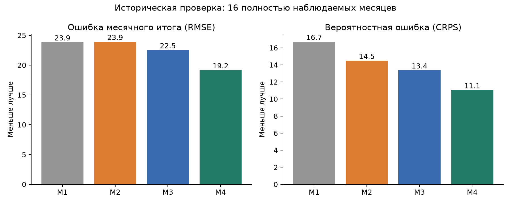
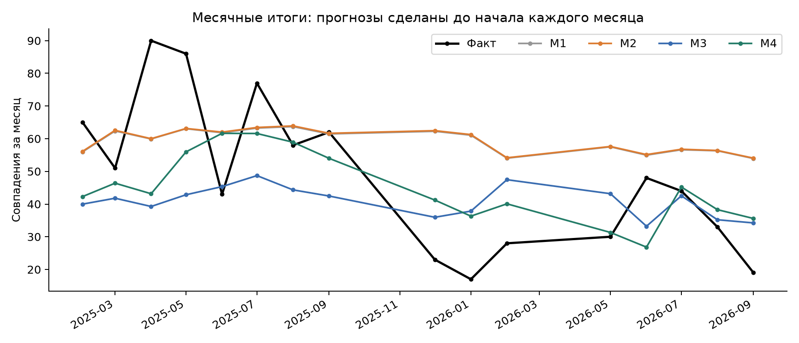
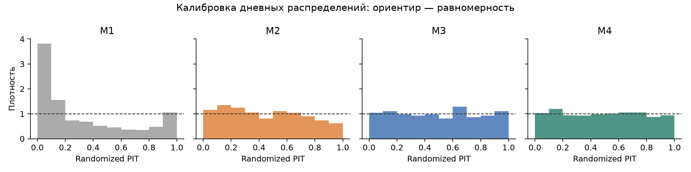
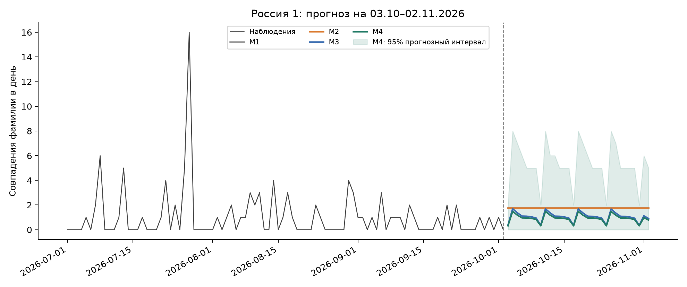

# Прогноз упоминаний Сталина на «России 1»

Расчёт выполнен 4 октября 2026 года по локальной выгрузке, которая заканчивается 2 октября 2026 года (Europe/Moscow). Лучший результат по выбранной метрике дала M4: **28,60 совпадения фамилии за 03.10–02.11.2026**, округлённо **29**, с **80%-м прогнозным интервалом 15–45** и **95%-м интервалом 10–59**. Медиана равна 26. Среднее используется как точечный прогноз при квадратичной функции потерь.

## 1. Что именно прогнозируется

Содержательная цель: количество упоминаний Иосифа Сталина в эфире «России 1» за месяц. Доступная измеримая переменная: число токенов `Сталин`, `Сталина`, `Сталину`, `Сталиным`, `Сталине` без учёта регистра в автоматических расшифровках всех передач из сохранённого архива. Показатель считает каждое произнесённое/распознанное совпадение, а не число сюжетов или дней с упоминанием. Повторы в разных выпусках учитываются. «Сталинград» и «сталинский» не подходят под исходный шаблон.

**Это приближение к числу упоминаний конкретного человека.** Полная ручная разметка 2 351 контекста не проводилась. Выборочная проверка обнаружила ошибки распознавания: например, «в сталину» в развлекательной передаче 13.01.2024, вероятно, соответствует «в старину». Есть также название танка «Иосиф Сталин». Такие случаи остаются в исходном ряду; модели не превращают кандидатов в проверенные персональные упоминания. Прогноз относится к доступному корпусу, а не к доказанно полному суточному эфиру. Для строго персонального ряда потребуется разметка контекстов и повторный расчёт тем же кодом.

Поскольку запрос касается канала, используются все сохранённые программы: новости, политические ток-шоу, развлекательные передачи и прочие фрагменты. Фильтр «только новости» не добавлялся. Будущие политические события и изменения сетки вещания неизвестны и не вводились как будто наблюдаемые признаки.

Один месяц определён как промежуток после последней даты до той же даты следующего месяца: с 03.10.2026 по 02.11.2026 включительно, **31 день**. Суточные распределения моделируются совместно, затем суммируются в месячный итог. Месячные интервалы получены из сумм целых траекторий; складывать границы дневных интервалов было бы ошибкой.

## 2. Данные и пропуски

Локальный источник: `data_collection/data/bigquery_upload/tv_daily_coverage.jsonl.gz`; исходные передачи, статусы и контексты находятся в `data/tv.sqlite`. Для расчёта не требуются BigQuery или повторное скачивание текстов. Использован канал `RUSSIA1`.

Период: 01.01.2023–02.10.2026, всего **1 371 календарный день**. Имеются **1 327 пригодных наблюдений**, **44 дня исключены**. Пригодный день требует доступного перечня (`inventory_status == 200`) и всех расшифровок перечисленных передач (`coverage_status == observed_listed_broadcasts`). Из 44 дней 43 уже помечены в выгрузке как неполные; дополнительно исключён 07.10.2025: расшифровки есть, но перечень имеет статус 404. Это консервативный критерий полноты относительно архива.

За пригодные дни найдено **2 350 совпадений**; за все имеющиеся фрагменты, включая неполные дни, 2 351. Пропуски остаются `NaN`, не заменяются нулями. В динамической модели состояние продолжает двигаться в пропущенный день, но обновления по наблюдению нет. Частично доступные дневные количества также не используются как полные наблюдения.

Среднее по пригодным дням: **1.771**, дисперсия: **8.783**, доля нулевых дней: **46.1%**. Дисперсия значительно больше среднего. Часть избыточного разброса связана с разными программами, повторными выпусками, меняющимся уровнем и доступностью архива. NB полезна как модель этого разброса; это ещё не доказательство конкретного причинного механизма.

При исключении пропусков предполагается, что наблюдаемые дни достаточно представительны. Это предположение нельзя проверить полностью: сбои архива и смена объёма расшифровок могут быть связаны с содержанием передач. Число слов известно только после эфира, поэтому будущий фактический объём текстов не используется в качестве предиктора. Интервалы ниже не покрывают систематическую ошибку измерения или неизвестную неполноту архива.

## 3. Четыре последовательных расширения

### M1. Постоянная интенсивность: Gamma–Poisson

$$Y_t\mid\lambda\sim\mathrm{Poisson}(\lambda),\qquad \lambda\sim\mathrm{Gamma}(1,1).$$

Здесь второй параметр Gamma — rate. После $n$ пригодных дней:

$$\lambda\mid D\sim\mathrm{Gamma}\left(1+\sum y_t,\;1+n\right).$$

Это разумная базовая модель: все наблюдаемые дни одного канала считаются сопоставимыми. Она не учитывает календарь и изменения уровня. Параметр $\lambda$ интегрируется, поэтому даже при пуассоновском условном распределении прогнозный разброс не равен точно среднему. Для каждой будущей траектории берётся один общий draw $\lambda$, затем независимые условные дневные количества. Это сохраняет зависимость из-за общей неопределённой интенсивности.

### M2. M1 + дополнительная дневная дисперсия

$$Y_t\mid\mu,\kappa\sim\mathrm{NB}(\mu,\kappa),\qquad
\operatorname{Var}(Y_t\mid\mu,\kappa)=\mu+\mu^2/\kappa.$$

Представление Gamma–Poisson: $\Lambda_t\mid\mu,\kappa\sim\mathrm{Gamma}(\kappa,\kappa/\mu)$, затем $Y_t\sim\mathrm{Poisson}(\Lambda_t)$. В M1 постоянен общий уровень; в M2 вокруг него допускаются дополнительные дневные колебания. При $\kappa\to\infty$ условное распределение приближается к Poisson.

Priors: $\log\mu\sim N(\log2,1.5^2)$, $\log\kappa\sim N(0,1.5^2)$. Иные priors относительно сопряжённой M1 нужны для этой параметризации и указаны явно. Posterior M2 вычисляется методом Metropolis–Hastings из L3. Прогноз усредняется по posterior draws, а не строится только в оценке среднего параметра.

Ожидаемое улучшение: более реалистичные хвосты и интервалы при всплесках. Само добавление дисперсии почти не меняет средний уровень; улучшение точечной ошибки не гарантируется.

### M3. M2 + календарная иерархия и тренд

$$\log\mu_t=\alpha+\beta u_t+b_{m(t)}+c_{w(t)}.$$

$u_t$ — время в годах, центрированное на среднем дне обучающего периода. $m(t)$ — месяц года, $w(t)$ — день недели. Для идентификации эффекты месяцев и дней недели имеют нулевую сумму. Ортонормированные контрасты реализуют это ограничение.

Priors: $\alpha\sim N(\log2,1.5^2)$, $\beta\sim N(0,0.5^2)$; календарные контрасты имеют общий внутри группы prior $N(0,0.4^2)$; $\log\kappa\sim N(0,1.5^2)$. Это частичное объединение: эффекты редких или шумных групп стягиваются к общему уровню. Масштабы 0,4 фиксированы, а не оценены как неизвестные гиперпараметры. Иерархия организована по календарным группам одного канала; данные других каналов не подмешиваются.

Решение из L4 адаптировано к счётным данным. Тренд нужен, поскольку постоянная интенсивность усредняет высокий исторический уровень вместе с более низкими недавними значениями. Календарь может отражать регулярную сетку передач и сезонные изменения. Posterior M3 также вычисляется Metropolis–Hastings. Ни будущие количества, ни будущие объёмы расшифровок не входят в признаки.

### M4. M3 + меняющийся скрытый уровень

$$\log\mu_t=\alpha+\beta u_t+b_{m(t)}+c_{w(t)}+\ell_t,$$
$$\ell_t=\ell_{t-1}+\varepsilon_t,\quad \varepsilon_t\sim N(0,q^2),\quad \ell_0\sim N(0,0.3^2).$$

Здесь появляется модель движения скрытого состояния и отдельная NB-модель наблюдения, как в L5. Нелинейная связь и счётные наблюдения требуют фильтра частиц вместо точного линейного Gaussian Kalman filter. Фильтр выполняет шаг движения, перевзвешивание по вероятности наблюдения и systematic resampling при ESS ниже половины числа частиц. Без resampling предыдущие веса сохраняются.

Для прогноза состояние движется вперёд без обновления по неизвестным наблюдениям. Случайное блуждание имеет нулевое среднее приращение в логарифме; неопределённость состояния растёт. В шкале количества ожидание включает эффект экспоненты, поэтому его нельзя получить просто экспонентой среднего состояния.

**Вычислительное приближение M4:** используется модульная смесь фильтров, условных на 128 draws статических параметров из M3; в каждом фильтре 64 частицы состояния, всего 8 192. Веса между статическими draws остаются равными. Это условный/модульный подход, а не полный совместный Bayesian posterior всех статических параметров и состояний. Статические параметры оцениваются на том же прошлом, на котором фильтруются состояния; фильтр здесь нужен для условной оценки состояния, а не для повторного независимого обновления статических параметров. При полном совместном анализе результаты и интервалы могут измениться.

$q$ выбран по среднему месячному CRPS на полностью наблюдаемых development-месяцах июня–декабря 2024 года из сетки $0;0.03;0.07;0.15$. Выбрано **$q=0.03$**. Development-прогнозы также используют только прошлые данные. Октябрь 2024 года неполон и в месячный критерий не входит. Тестовые месяцы 2025–2026 годов не использовались для выбора $q$.

## 4. Как выполнена оценка

Проведён expanding-window backtest: **21 точка прогнозирования** перед началом каждого месяца с января 2025 по сентябрь 2026. Для каждой точки все модели заново обучаются на доступных пригодных днях строго до начала месяца; затем сразу прогнозируется весь следующий месяц, без обновления внутри него. Подход отвечает горизонту задачи, в отличие от оценки однодневных прогнозов с ежедневным переобучением.

**Дневные метрики:** 626 наблюдаемых тестовых дней. Для всех четырёх моделей используются одинаковые дни. Прогнозы для пропусков строятся, но не оцениваются.

**Основная месячная оценка:** 16 полностью наблюдаемых месяцев. Месяцы 2025-01, 2025-10, 2025-11, 2026-03, 2026-04 исключены из неё. Для них отдельно сохранены результаты суммы только наблюдаемых дней в `backtest_by_origin.csv`; такие суммы не выдаются за полный месячный итог.

Основной критерий выбора — **CRPS месячного распределения**, поскольку задача включает прогноз количества и его неопределённость. Для случайных величин $X,X'$ из прогнозного распределения:

$$\operatorname{CRPS}(F,y)=E|X-y|-\tfrac12E|X-X'|.$$

CRPS вычисляется по траекториям без подбора границ после наблюдения результата. Меньше лучше; единица измерения такая же, как у количества. Дополнительно вычислены RMSE и MAE для posterior predictive mean, отрицательный log score (NLL) дневного количества, покрытие и ширина 80%/95% интервалов, randomized PIT для дискретных прогнозов. Brier score не применяется к самому счётному исходу.

Для каждого backtest используется 6 000 траекторий; для финального прогноза — 30 000. Общие параметры и состояние сохраняются внутри траектории, поэтому месячный разброс учитывает зависимость между будущими днями.

Это **ретроспективный pseudo-out-of-sample backtest по текущему снимку расшифровок**. Исторические версии архива и время фактической публикации каждого текста не восстановлены. Схема обучения исключает будущие исходы, но не доказывает, что такой же корпус был доступен исследователю в реальном времени на каждой старой дате. M4 выбирается среди четырёх заранее заданных моделей по этому тесту; отдельного второго теста после выбора победителя нет.

## 5. Результаты

| Модель | RMSE месячного итога | CRPS месячного итога | Покрытие 80% | Покрытие 95% |
| --- | --- | --- | --- | --- |
| M1 | 23.86 | 16.72 | 25.0% | 43.8% |
| M2 | 23.94 | 14.49 | 56.2% | 81.2% |
| M3 | 22.55 | 13.38 | 62.5% | 87.5% |
| M4 | 19.18 | 11.06 | 81.2% | 93.8% |

По основному месячному CRPS каждое расширение улучшает предыдущую модель: **16,72 → 14,49 → 13,38 → 11,06**. M2 улучшает распределение и покрытие, но слегка ухудшает RMSE: 23,86 → 23,94. Поэтому утверждение «каждая модель лучше по всем метрикам» было бы неверным. Также M4 имеет немного больший дневной MAE, чем M3; выбор делается по месячной задаче.

M4 снижает месячный CRPS относительно M1 на **33.9%**, а RMSE на **19.6%** в этой исторической выборке. 80%-й месячный интервал M4 покрывает 13 из 16 результатов, 95%-й — 15 из 16. Это согласуется с заданными уровнями приблизительно, но 16 месяцев мало для точной проверки калибровки. У M1 95%-й интервал покрывает только 7 из 16 месячных итогов.

| Модель | Дневной RMSE | Дневной MAE | Дневной CRPS | Дневной NLL |
| --- | --- | --- | --- | --- |
| M1 | 2.684 | 1.848 | 1.291 | 2.288 |
| M2 | 2.685 | 1.85 | 1.094 | 1.644 |
| M3 | 2.599 | 1.537 | 1.033 | 1.605 |
| M4 | 2.574 | 1.543 | 1.019 | 1.593 |

Randomized PIT рассчитывается как $F(y-1)+U\,P(Y=y)$, $U\sim U(0,1)$, по симулированным дневным распределениям. У M1 виден избыток низких PIT; M3/M4 ближе к равномерному ориентиру. Этот график показывает маргинальную дневную калибровку, но не подтверждает правильную зависимость дней или калибровку месячного итога.

### Значимость различий

Сравнения пар выполнены по потерям на одних и тех же 16 неперекрывающихся месяцах. Сохранены приблизительный Diebold–Mariano с HAC lag 1 и двусторонним t-ориентиром, а также circular moving-block bootstrap с блоками по два месяца. В таблице положительное снижение потерь означает преимущество более поздней модели.

| Переход | Снижение CRPS | p (приблизительный DM) | 95% блоковый bootstrap |
| --- | --- | --- | --- |
| M1 → M2 | 2.23 | 0.004 | 0.95…3.38 |
| M2 → M3 | 1.12 | 0.777 | -6.13…8.63 |
| M3 → M4 | 2.32 | 0.051 | 0.25…4.55 |
| M1 → M4 | 5.66 | 0.155 | -1.01…13.24 |

M2 убедительно улучшает CRPS относительно M1 в этой проверке. Для M3 против M2 убедительного преимущества не получено. У M4 против M3 результат пограничный: приблизительный DM даёт $p\approx0.051$, а двухмесячный bootstrap-интервал положителен. Разные проверки дают разные выводы возле порога 5%; при 16 месяцах, выбранной длине блока и нескольких сравнениях нельзя заявлять устойчивое доказанное преимущество M4. M4 имеет лучший средний результат, поэтому используется для итогового прогноза. Значения $p$ представлены без поправки за несколько сравнений.

## 6. Прогноз на 03.10–02.11.2026

| Модель | Среднее | Медиана | 80% интервал | 95% интервал |
| --- | --- | --- | --- | --- |
| M1 | 54.88 | 55 | 45–64 | 41–70 |
| M2 | 55.01 | 53 | 36–76 | 28–90 |
| M3 | 32.56 | 31 | 19–47 | 15–58 |
| M4 | 28.60 | 26 | 15–45 | 10–59 |

Все интервалы **прогнозные для фактического будущего количества**, а не интервалы только для неизвестного среднего. Точечный итог — среднее; округление до целого выполняется лишь для удобства чтения. Вероятность хотя бы 50 совпадений по M4 составляет **6.2%**. Это модельная вероятность для измеряемого ряда.

M1/M2 сохраняют усреднённый за всю историю уровень и дают около 55 совпадений. M3 учитывает спад и календарь, прогнозируя около 33. M4 дополнительно корректирует уровень по недавним данным, прогнозируя около 29. Это интерпретация модели, а не установленная причина изменения внимания к Сталину.

## 7. Проверка вычислений и воспроизводимость

M2/M3: четыре MH-цепи, 300 warmup и 1 200 сохранённых draws на цепь; при недостаточных диагностических показателях код увеличивает длину. Локальная Laplace-аппроксимация используется только для предложения multivariate t в MH; принятие/отклонение считается по точной posterior плотности. Поэтому M2/M3 не подменены нормальной аппроксимацией posterior.

В финальной M3 максимальный rank-normalized split/folded R-hat **1.0054**, минимальный autocorrelation ESS **1493**. По всем тестовым подгонкам M2/M3 максимальный R-hat **1.0084**, минимальный ESS **1044**. ESS здесь оценён по автокорреляциям цепей, а не выдан за ArviZ bulk ESS.

Дополнительно M4 повторена на трёх seeds с 8 192 и 32 768 частицами. Средние месячные итоги составили **27.78–28.30**, нижние 95%-е границы 10, верхние 56–58; основной расчёт дал 28,60 и верхнюю границу 59. Размер частиц и случайные posterior draws вносят небольшую вычислительную погрешность. Поэтому итог сообщается как «около 29», а границы не следует трактовать как точные вне модели. Эта проверка контролирует Monte Carlo устойчивость, но не устраняет модульное приближение M4.

Автоматические проверки подтвердили NB-вероятности независимой реализацией SciPy, CRPS прямой попарной формулой, аналитические градиенты численным дифференцированием, даты обучения, одинаковые тестовые дни, неотрицательные целые траектории и месячные интервалы из сумм траекторий. Результат — `verification.json`.

Файлы:

- `stalin_russia1_forecast.ipynb`: выполненная тетрадка с кодом всех моделей, таблицами и графиками.
- `forecast_daily.csv`, `forecast_month.csv`: прогнозы четырёх моделей по дням и на весь месяц.
- `evaluation.csv`, `backtest_by_origin.csv`, `backtest_daily.csv`: оценка и исходные прогнозы исторической проверки.
- `development_scores.csv`: выбор $q$ только на development-периоде.
- `model_comparisons.csv`: статистические сравнения.
- `daily_data.csv`: использованный ряд и признаки доступности; пропуски сохранены.
- `posterior_samples.npz`, `forecast_paths.npz`: posterior draws M2/M3 и все финальные траектории.
- `final_diagnostics.json`, `backtest_diagnostics.json`, `particle_stability.csv`, `metadata.json`: диагностика и происхождение результатов.

Для повторного расчёта в проекте: `python analysis/stalin_models.py`, затем `python analysis/verify_forecast.py`. Тетрадка запускается через Run All и сама находит папку проекта. Для переноса нужны исходная суточная выгрузка и сохранённая структура папок. Анализ не изменяет вложенные Library-файлы и исходную ТВ-базу.

Версии зависимостей записаны в `requirements.txt`. Seed: **20261004**. SHA-256 входного сжатого файла: `4a22416af5b3d5bb504080eeb4da71557553a28c719b0e875aad5fdf697af4f3`.

## 8. Связь с предоставленными материалами

- **Forecasting Project Instructions**, стр. 1–2: целевая величина, горизонт, несколько моделей, оценка на нескольких событиях, сравнение и интерпретация. Два приложенных файла инструкций имеют одинаковый SHA-256; содержание совпадает. Указанные там обязанности по proposal, команде и презентации не трактуются как отдельный запрос пользователя на их создание.
- **L1 Forecast Evaluation A**, стр. 12, 18, 22–24: точечный, интервальный и вероятностный прогноз; калибровка, sharpness, proper scores и связь среднего с квадратичной потерей. CRPS — выбранная здесь конкретная реализация принципа proper scoring; он не приписывается отдельному слайду как показанная там формула.
- **L1 Forecast Evaluation B**: разделение качества решения и качества прогнозного распределения.
- **L2 Bayesian Mechanics B**, стр. 23–25: Bayesian update и недопустимость повторного счёта одного и того же сигнала как независимого свидетельства.
- **L3 Bayesian Computation**: posterior predictive averaging, Metropolis–Hastings и диагностика выборки; стр. 65–70: вероятностный score и неопределённость разницы scores.
- **ha15491_6191_3.ipynb**, Problem 3: NB-параметризация $\mu+\mu^2/\kappa$, сравнение с Poisson, posterior predictive score; предупреждение, что LOO по историческим дням не равно прогнозу будущего. Поэтому основной расчёт здесь использует хронологический backtest.
- **L4 Hierarchical Modeling**, стр. 17–27, и **S4_Hierarchical_Models.ipynb**, разделы 2 и 4: partial pooling и счётная иерархия. **HA4_Hierarchical_Models.ipynb** использован как дополнительный учебный контекст; его домашние задания не выполняются вместо пользовательского прогноза.
- **L5 Sequential Forecasting**, стр. 8–9, 37–42, 68–69, 79: модель состояния и наблюдения, оценка прогноза, доступного на соответствующую дату, фильтр частиц, сохранение весов без resampling и проверка устойчивости.

Первичный источник корпуса указан в README исходного проекта: [GDELT Visual Explorer: перечни и расшифровки ТВ](https://blog.gdeltproject.org/visual-explorer-quick-workflow-for-downloading-belarusian-russian-ukrainian-transcripts-translations/). Этот расчёт использует сохранённую локальную выгрузку и не подтверждает заново доступность внешнего архива.
